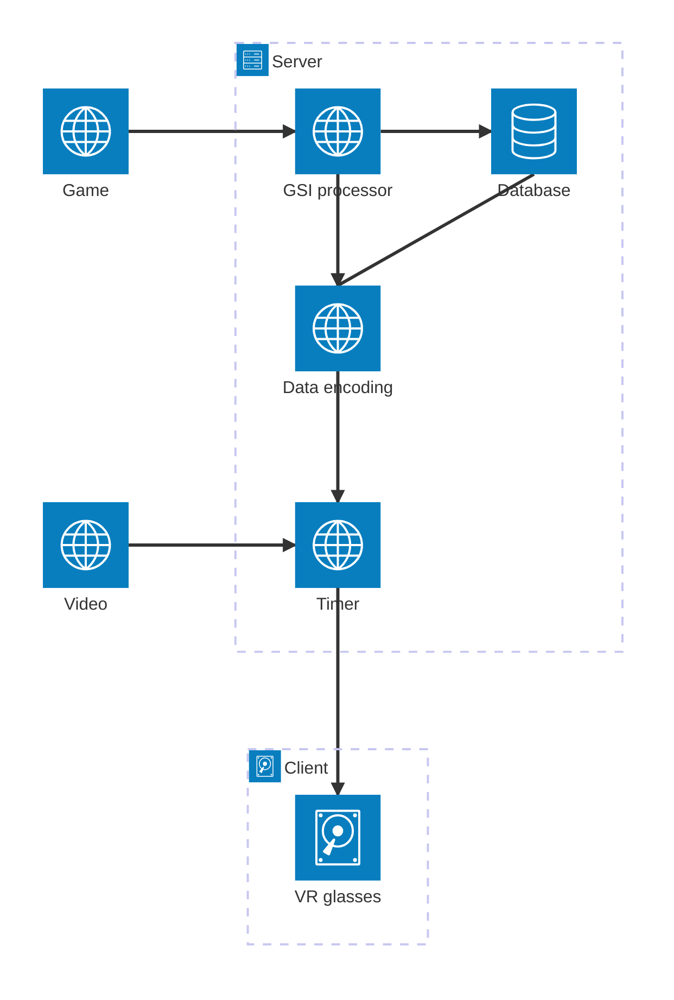

# Arkkitehtuurin suunnitelma

## Arkkitehtuurikaavio

## Suunnitelma

### Serverin puoli
Pelistä lähetetään dataa suoraan Openshiftiin, jolloin se on sovelluksen käytettävissä. GSI processor karsii datasta muun kuin sovelluksen tarvitseman datan. Karsinnan jälkeen data siirretään joko suoraan encoding-osioon ja/tai tallennetaan tietokantaan. Encoding muuttaa datan sellaiseen muotoon, että Unity pystyy käsittelemään sitä (JSON). Tietokannasta tuleva data menee myös encodingin läpi.

*Video ja data tulevat yhteiseen timeriin, jossa videon kuva ja data saadaan synkronisoitua. Ei ajankohtainen ominaisuus*

### Clientin puoli
Client on VR-lasit ja Unity. Serveri ja Unity saavat yhteyden WebSocketin avulla, jolloin data saadaan Unitylle käytettäväksi. Unityssä tapahtuu datan renderöinti VR-ympäristöön.

