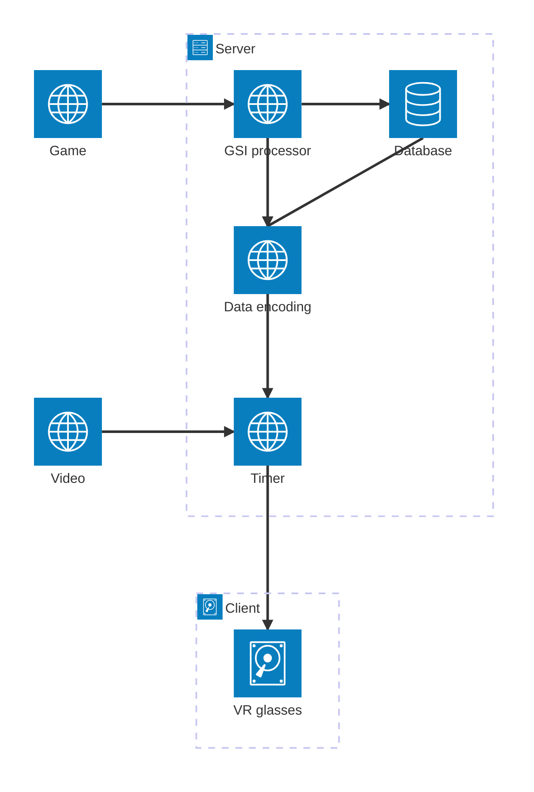

# Plan for the Architecture

## Architecture diagram

## The plan

### Server side
The game sends data directly to Openshift where it is available to the app. GSI processor parses the data and removes unnecessary parts. After parsing the data is either moved directly to encoding and/or saved to database. Encoding changes the data into JSON so Unity can handle it. The data coming from the database also goes through the encoding.

*The video and data have a shared timer where the video feed and data can be synced. Not a current feature*

### Client side
The client includes the VR glasses and Unity. Currently Unity fetches the data from the Openshift address. *A websocket implementation as the connection was planned but not implemented.* After fetching the data, Unity renders it into the VR environment.

