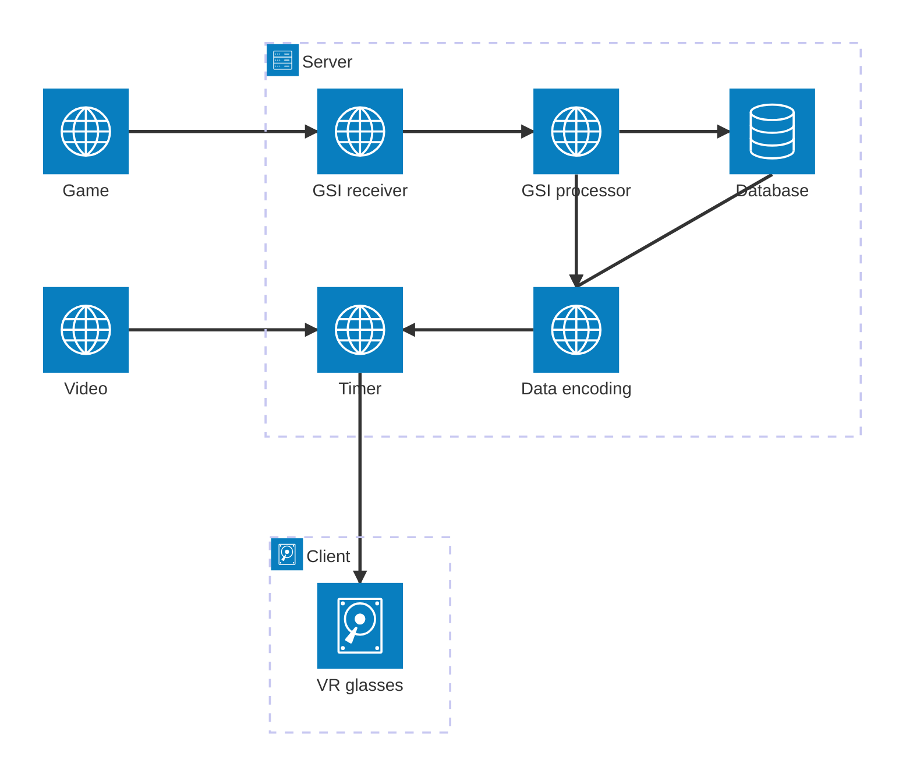

# Arkkitehtuurin suunnitelma

```mermaid
architecture-beta
  group server(server)[Server]
  group client(disk)[Client]

  service db(database)[Database] in server
  service gsi_receiver(internet)[GSI receiver] in server
  service gsi_processor(internet)[GSI processor] in server
  service encoding(internet)[Data encoding] in server
  service timer(internet)[Timer] in server
  service glasses(disk)[VR glasses] in client

  service game(internet)[Game]
  service video(internet)[Video]

  game:R --> L:gsi_receiver
  gsi_receiver:R --> L:gsi_processor
  gsi_processor:R --> L:db
  gsi_processor:B --> T:encoding
  db:B --> T:encoding
  encoding:L --> R:timer
  video:R --> L:timer
  timer:B --> T:glasses
  
```
