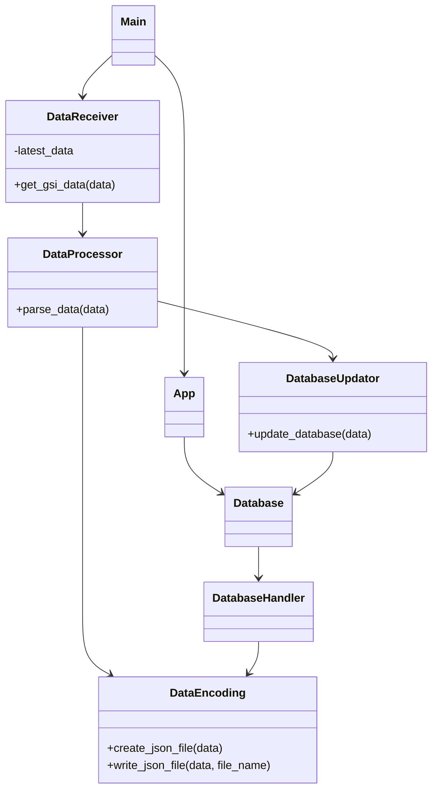

```mermaid
classDiagram
    class Main

    class App

    class Database

    class DataReceiver
    DataReceiver : -latest_data
    DataReceiver : +get_gsi_data(data)

    class DataProcessor
    DataProcessor : +parse_data(data)

    class DatabaseUpdator
    DatabaseUpdator : +update_database(data)

    class DatabaseHandler

    class DataEncoding
    DataEncoding : +create_json_file(data)
    DataEncoding : +write_json_file(data, file_name)

    Main --> App
    Main --> DataReceiver
    App --> Database
    DatabaseUpdator --> Database
    DataReceiver --> DataProcessor
    DataProcessor --> DataEncoding
    DataProcessor --> DatabaseUpdator
    Database --> DatabaseHandler
    DatabaseHandler --> DataEncoding
```
