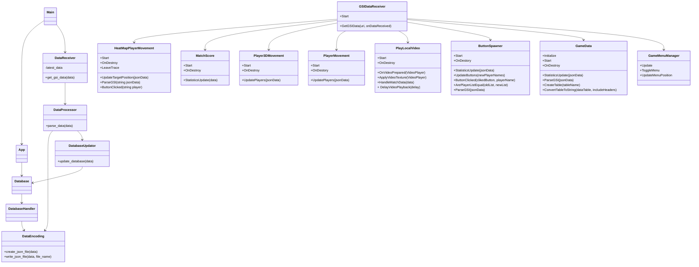

```mermaid
classDiagram
    class Main

    class App

    class Database

    class DataReceiver
    DataReceiver : -latest_data
    DataReceiver : +get_gsi_data(data)

    class DataProcessor
    DataProcessor : +parse_data(data)

    class DatabaseUpdator
    DatabaseUpdator : +update_database(data)

    class DatabaseHandler

    class DataEncoding
    DataEncoding : +create_json_file(data)
    DataEncoding : +write_json_file(data, file_name)

    class GSIDataReceiver
    GSIDataReceiver : +Start
    GSIDataReceiver : +GetGSIData(uri, onDataReceived)

    class HeatMapPlayerMovement
    HeatMapPlayerMovement : +Start
    HeatMapPlayerMovement : +OnDestroy
    HeatMapPlayerMovement : +LeaveTrace
    HeatMapPlayerMovement : +UpdateTargetPosition(jsonData)
    HeatMapPlayerMovement : +ParseGSI(string jsonData)
    HeatMapPlayerMovement : +ButtonClicked(string player)

    class MatchScore
    MatchScore : +Start
    MatchScore : +StatisticsUpdate(data)
    MatchScore : +OnDestroy

    class Player3DMovement
    Player3DMovement : +Start
    Player3DMovement : +OnDestroy
    Player3DMovement : +UpdatePlayers(jsonData)

    class PlayerMovement
    PlayerMovement : +Start
    PlayerMovement : +OnDestory
    PlayerMovement : +UpdatePlayers(jsonData)

    class PlayLocalVideo
    PlayLocalVideo : +Start
    PlayLocalVideo : +OnDestroy
    PlayLocalVideo : +OnVideoPrepared(VideoPlayer)
    PlayLocalVideo : +ApplyVideoTexture(VideoPlayer)
    PlayLocalVideo : +HandleMatchData(data)
    PlayLocalVideo : + DelayVideoPlayback(delay)

    class ButtonSpawner
    ButtonSpawner : +Start
    ButtonSpawner : +OnDestory
    ButtonSpawner : +StatisticsUpdate(jsonData)
    ButtonSpawner : +UpdateButtons(newPlayerNames)
    ButtonSpawner : +ButtonClicked(clikedButton, playerName)
    ButtonSpawner : +ArePlayerListEqual(oldList, newList)
    ButtonSpawner : +ParseGSI(jsonData)

    class GameData
    GameData : +Initialize
    GameData : +Start
    GameData : +OnDestroy
    GameData : +StatisticsUpdate(jsonData)
    GameData : +ParseGSI(jsonData)
    GameData : +CreateTable(tableName)
    GameData : +ConvertTableToString(dataTable, includeHeaders)
    
    class GameMenuManager
    GameMenuManager : +Update
    GameMenuManager : +ToggleMenu
    GameMenuManager : +UpdateMenuPosition


    Main --> App
    Main --> DataReceiver
    App --> Database
    DatabaseUpdator --> Database
    DataReceiver --> DataProcessor
    DataProcessor --> DataEncoding
    DataProcessor --> DatabaseUpdator
    Database --> DatabaseHandler
    DatabaseHandler --> DataEncoding
    GSIDataReceiver --> HeatMapPlayerMovement
    GSIDataReceiver --> MatchScore
    GSIDataReceiver --> Player3DMovement
    GSIDataReceiver --> PlayerMovement
    GSIDataReceiver --> PlayLocalVideo
    GSIDataReceiver --> ButtonSpawner
    GSIDataReceiver --> GameData
    GSIDataReceiver --> GameMenuManager
    
```
