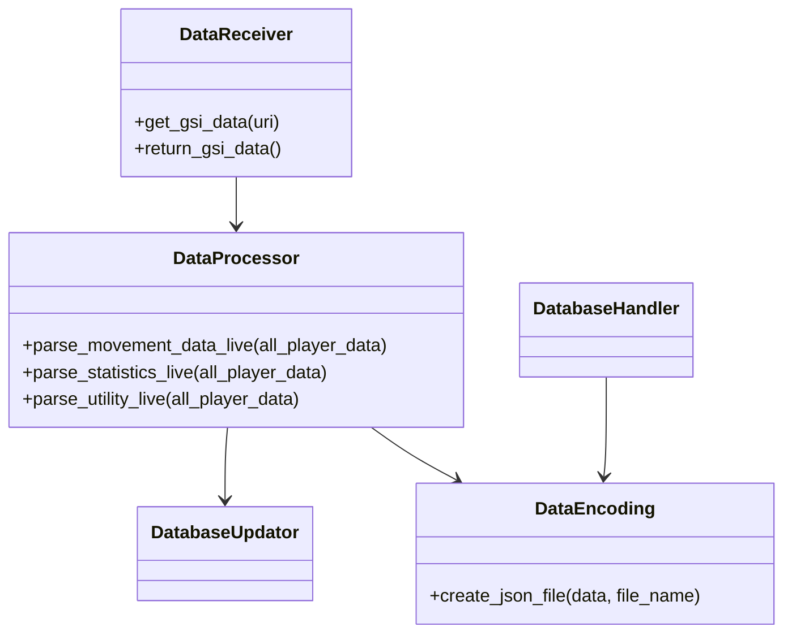

```mermaid
classDiagram
    class DataReceiver
    DataReceiver : +get_gsi_data(uri)
    DataReceiver : +return_gsi_data()

    class DataProcessor
    DataProcessor : +parse_movement_data_live(all_player_data)
    DataProcessor : +parse_statistics_live(all_player_data)
    DataProcessor : +parse_utility_live(all_player_data)

    class DatabaseUpdator

    class DatabaseHandler

    class DataEncoding
    DataEncoding : +create_json_file(data, file_name)

    DataReceiver --> DataProcessor
    DataProcessor --> DataEncoding
    DataProcessor --> DatabaseUpdator
    DatabaseHandler --> DataEncoding
```
